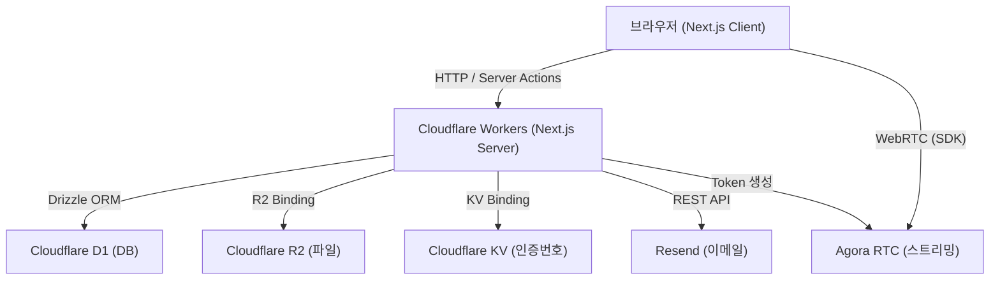

# 기술 설계 문서: ballbot-tv

## 개요

ballbot-tv는 브라우저만으로 실시간 동영상 스트리밍 송출 및 시청이 가능한 서비스입니다. OBS 같은 전용 프로그램 없이 브라우저에서 바로 방송을 시작할 수 있으며, 비회원도 방송을 시청할 수 있습니다.

### 기술 스택

| 레이어 | 기술 |
|--------|------|
| 프레임워크 | Next.js (App Router) + `@opennextjs/cloudflare` |
| 런타임 | Cloudflare Workers |
| 데이터베이스 | Cloudflare D1 (SQLite) + Drizzle ORM |
| 파일 스토리지 | Cloudflare R2 (프로필 사진, 썸네일) |
| 임시 저장소 | Cloudflare KV (이메일 인증번호) |
| 이메일 발송 | Resend |
| 실시간 스트리밍 | Agora RTC (`agora-rtc-sdk-ng`, `agora-rtc-react`) |
| UI 컴포넌트 | shadcn/ui + Tailwind CSS |

### 설계 원칙

- **서버 컴포넌트 우선**: Next.js App Router의 서버 컴포넌트를 기본으로 사용하고, Agora RTC처럼 브라우저 전용 라이브러리는 `dynamic import + ssr: false`로 격리
- **엣지 우선**: Cloudflare Workers 환경에서 동작하므로 Node.js 전용 API 사용 금지
- **최소 권한**: Agora 토큰은 서버에서 생성하며, 시청자는 `SUBSCRIBER` 역할, 송출자는 `PUBLISHER` 역할로 분리
- **UI 일관성**: 모든 UI 컴포넌트는 shadcn/ui를 기반으로 구성하며, Tailwind CSS로 스타일링
- **반응형 우선**: 모바일 퍼스트(mobile-first) 접근으로 설계하며, 모든 화면은 모바일·태블릿·데스크톱을 지원

---

## 아키텍처



### 요청 흐름

1. 브라우저가 Next.js 서버(Cloudflare Workers)에 HTTP 요청 또는 Server Action 호출
2. 서버는 D1(Drizzle ORM), R2, KV 바인딩을 통해 데이터 처리
3. 스트리밍 관련 요청은 서버에서 Agora 토큰을 생성하여 클라이언트에 전달
4. 클라이언트는 Agora SDK를 통해 직접 Agora 인프라와 WebRTC 연결

---

## UI 설계 및 반응형 레이아웃

### UI 컴포넌트 라이브러리

모든 UI는 **shadcn/ui** 컴포넌트를 기반으로 구성합니다. 사용하는 주요 컴포넌트는 다음과 같습니다.

| 용도 | shadcn/ui 컴포넌트 |
|------|-------------------|
| 폼 입력 | `Input`, `Label`, `Form` (react-hook-form 연동) |
| 버튼 | `Button` (variant: default, destructive, outline, ghost) |
| 다이얼로그 | `Dialog`, `AlertDialog` (방송 종료 확인 등) |
| 드롭다운 | `DropdownMenu`, `Select` (카메라 소스 선택) |
| 토스트 알림 | `Sonner` (업로드 성공/실패, 방송 종료 알림) |
| 아바타 | `Avatar` (프로필 사진, 기본 이미지 fallback) |
| 배지 | `Badge` (LIVE 표시, 시청자 수) |
| 스켈레톤 | `Skeleton` (방송 목록 로딩 상태) |
| 시트 | `Sheet` (모바일 네비게이션 드로어) |
| 탭 | `Tabs` (채널 페이지 등) |

### 반응형 브레이크포인트

Tailwind CSS 기본 브레이크포인트를 사용합니다.

| 브레이크포인트 | 범위 | 대상 기기 |
|--------------|------|----------|
| `sm` | 640px 이상 | 대형 모바일 |
| `md` | 768px 이상 | 태블릿 |
| `lg` | 1024px 이상 | 소형 데스크톱 |
| `xl` | 1280px 이상 | 데스크톱 |

### 화면별 반응형 레이아웃

#### 홈 화면

```
[데스크톱 lg+]
┌──────────────┬────────────────────────────────────┐
│  사이드바     │  검색바                             │
│  (240px)     ├────────────────────────────────────┤
│  - 홈        │  방송 카드 그리드 (4열)              │
│  - 구독 목록  │                                    │
└──────────────┴────────────────────────────────────┘

[태블릿 md~lg]
┌──────────────┬────────────────────────────────────┐
│  사이드바     │  검색바                             │
│  (아이콘만)   ├────────────────────────────────────┤
│              │  방송 카드 그리드 (2열)              │
└──────────────┴────────────────────────────────────┘

[모바일 ~md]
┌────────────────────────────────────────────────────┐
│  상단바 (로고 + 검색 아이콘 + 햄버거 메뉴)           │
├────────────────────────────────────────────────────┤
│  방송 카드 그리드 (1열 또는 2열)                     │
└────────────────────────────────────────────────────┘
  → 사이드바는 Sheet 컴포넌트로 슬라이드 드로어로 전환
```

#### 방송 시청 화면

```
[데스크톱 lg+]
┌──────────────┬──────────────────────────┬──────────┐
│  사이드바     │  영상 플레이어 (메인)      │ 다른 방송 │
│              ├──────────────────────────┤ 목록     │
│              │  스트리머 정보 + 구독 버튼 │ (280px)  │
└──────────────┴──────────────────────────┴──────────┘

[태블릿 md~lg]
┌──────────────────────────────────────────────────┐
│  영상 플레이어 (전체 너비)                          │
├──────────────────────────────────────────────────┤
│  스트리머 정보 + 구독 버튼                          │
├──────────────────────────────────────────────────┤
│  다른 방송 목록 (가로 스크롤)                       │
└──────────────────────────────────────────────────┘

[모바일 ~md]
┌────────────────────────────────────────────────────┐
│  영상 플레이어 (16:9 비율 유지)                      │
├────────────────────────────────────────────────────┤
│  스트리머 정보 + 구독 버튼                           │
├────────────────────────────────────────────────────┤
│  다른 방송 목록 (세로 스크롤)                        │
└────────────────────────────────────────────────────┘
```

#### 스트리머 송출 화면

```
[데스크톱 lg+]
┌────────────────────────────────────────────────────┐
│  내 화면 미리보기 (전체 너비, 16:9)                  │
│                                    [시청자 수 우상단] │
│  [시간 + 방송제목 좌하단]                            │
├────────────────────────────────────────────────────┤
│  [마이크] [카메라] [소스선택] [설정]  [방송종료]      │
└────────────────────────────────────────────────────┘

[모바일 ~md]
┌────────────────────────────────────────────────────┐
│  내 화면 미리보기 (전체 너비, 16:9)                  │
│                                    [시청자 수 우상단] │
│  [시간 + 방송제목 좌하단]                            │
├────────────────────────────────────────────────────┤
│  [마이크] [카메라] [소스선택]                        │
├────────────────────────────────────────────────────┤
│  [설정]              [방송종료]                      │
└────────────────────────────────────────────────────┘
  → 컨트롤 버튼은 2행으로 분리
```

### 다크 모드

shadcn/ui의 `ThemeProvider`를 사용하여 시스템 설정에 따른 다크/라이트 모드를 지원합니다. 기본값은 시스템 설정을 따릅니다.

---

## 컴포넌트 및 인터페이스

### 서버 모듈

#### Auth_Service (`src/lib/auth.ts`)

- `signUp(data)`: 회원가입 처리 (유효성 검증 → 이메일 발송 → KV 저장)
- `verifyEmail(userId, code)`: 인증번호 검증 및 회원 활성화
- `signIn(username, password)`: 로그인 및 세션 쿠키 발급
- `signOut()`: 세션 쿠키 삭제
- `getSession()`: 현재 세션 조회

세션은 `HttpOnly` 쿠키에 서명된 JWT로 관리합니다. Cloudflare Workers 환경에서는 `jose` 라이브러리를 사용합니다.

#### Email_Service (`src/lib/email.ts`)

- `sendVerificationCode(email, code)`: Resend API를 통해 인증번호 이메일 발송

#### Streaming_Service (`src/lib/streaming.ts`)

- `generateAgoraToken(channelName, uid, role)`: Agora `agora-token` 패키지로 RTC 토큰 생성
- `createStream(streamerId, data)`: D1에 Stream 레코드 생성
- `endStream(streamId)`: Stream 상태를 종료로 업데이트
- `getActiveStreams()`: 진행 중인 공개 Stream 목록 조회 (시청자 수 내림차순)

#### Storage_Service (`src/lib/storage.ts`)

- `uploadProfileImage(userId, file)`: R2에 프로필 사진 업로드 (형식·크기 검증 포함)
- `uploadThumbnail(streamId, blob)`: R2에 썸네일 업로드
- `getPublicUrl(key)`: R2 퍼블릭 URL 반환

#### Search_Service (`src/lib/search.ts`)

- `searchStreams(query)`: 방송 제목·설명 LIKE 쿼리 실행

### 클라이언트 컴포넌트

#### `StreamerStudio` (`src/components/streaming/StreamerStudio.tsx`)

Agora RTC를 사용하는 송출 전용 클라이언트 컴포넌트. `dynamic import + ssr: false`로 로드.

- 카메라/마이크 트랙 생성 및 publish
- 화면 공유 (별도 클라이언트 인스턴스 사용)
- 마이크/카메라 토글
- 시청자 수 폴링 (5초 간격)
- 방송 시작 시 썸네일 캡처 후 서버로 업로드

#### `StreamViewer` (`src/components/streaming/StreamViewer.tsx`)

Agora RTC를 사용하는 시청 전용 클라이언트 컴포넌트. `dynamic import + ssr: false`로 로드.

- `SUBSCRIBER` 역할로 채널 참여
- `user-published` 이벤트로 영상/음성 구독
- 방송 종료 감지 후 홈으로 이동

#### `AgoraProvider` (`src/components/streaming/AgoraProvider.tsx`)

`AgoraRTCProvider`와 클라이언트 인스턴스를 동적으로 생성하는 래퍼. Next.js App Router SSR 문제를 회피하기 위해 `dynamic import + ssr: false`로 로드.

### API Routes

| 경로 | 메서드 | 설명 |
|------|--------|------|
| `/api/auth/signup` | POST | 회원가입 |
| `/api/auth/verify` | POST | 이메일 인증번호 확인 |
| `/api/auth/signin` | POST | 로그인 |
| `/api/auth/signout` | POST | 로그아웃 |
| `/api/agora/token` | POST | Agora RTC 토큰 발급 |
| `/api/streams` | POST | 방송 생성 |
| `/api/streams/[id]` | PATCH | 방송 상태 업데이트 (종료) |
| `/api/streams/[id]/viewer-count` | GET | 시청자 수 조회 |
| `/api/upload/profile` | POST | 프로필 사진 업로드 |
| `/api/upload/thumbnail` | POST | 썸네일 업로드 |
| `/api/subscriptions` | POST/DELETE | 채널 구독/구독취소 |

---

## 데이터 모델

### D1 스키마 (Drizzle ORM)

```typescript
// src/db/schema.ts

import { sqliteTable, text, integer, index } from 'drizzle-orm/sqlite-core';

export const users = sqliteTable('users', {
  id: text('id').primaryKey(),                    // ULID
  username: text('username').notNull().unique(),   // 아이디 (영문·숫자, 4-20자)
  passwordHash: text('password_hash').notNull(),
  channelName: text('channel_name').notNull(),
  email: text('email').notNull().unique(),
  profileImageKey: text('profile_image_key'),     // R2 오브젝트 키
  isVerified: integer('is_verified', { mode: 'boolean' }).notNull().default(false),
  createdAt: integer('created_at', { mode: 'timestamp' }).notNull(),
});

export const streams = sqliteTable('streams', {
  id: text('id').primaryKey(),                    // ULID
  streamerId: text('streamer_id').notNull().references(() => users.id),
  title: text('title').notNull(),
  description: text('description'),
  isPublic: integer('is_public', { mode: 'boolean' }).notNull().default(true),
  status: text('status', { enum: ['live', 'ended'] }).notNull().default('live'),
  agoraChannel: text('agora_channel').notNull().unique(), // Agora 채널명
  thumbnailKey: text('thumbnail_key'),            // R2 오브젝트 키
  viewerCount: integer('viewer_count').notNull().default(0),
  startedAt: integer('started_at', { mode: 'timestamp' }).notNull(),
  endedAt: integer('ended_at', { mode: 'timestamp' }),
}, (t) => ({
  statusIdx: index('streams_status_idx').on(t.status),
  streamerIdx: index('streams_streamer_idx').on(t.streamerId),
}));

export const subscriptions = sqliteTable('subscriptions', {
  id: text('id').primaryKey(),
  subscriberId: text('subscriber_id').notNull().references(() => users.id),
  channelId: text('channel_id').notNull().references(() => users.id),
  createdAt: integer('created_at', { mode: 'timestamp' }).notNull(),
}, (t) => ({
  uniqueSub: index('subscriptions_unique_idx').on(t.subscriberId, t.channelId),
}));
```

### Cloudflare KV 구조

이메일 인증번호는 KV에 TTL 600초(10분)로 저장합니다.

```
키:   email_verification:{userId}
값:   { code: "123456", email: "user@example.com" }
TTL:  600초
```

재발송 시 동일 키로 덮어쓰면 이전 코드가 자동 무효화됩니다.

### Cloudflare R2 키 구조

```
profiles/{userId}/{timestamp}.{ext}     # 프로필 사진
thumbnails/{streamId}/{timestamp}.webp  # 방송 썸네일
```

### Agora 채널 명명 규칙

```
stream_{streamId}
```

스트림 ID(ULID)를 채널명으로 사용하여 충돌을 방지합니다.

---

## 정확성 속성 (Correctness Properties)

*속성(Property)이란 시스템의 모든 유효한 실행에서 참이어야 하는 특성 또는 동작입니다. 즉, 시스템이 무엇을 해야 하는지에 대한 형식적 명세입니다. 속성은 사람이 읽을 수 있는 명세와 기계가 검증할 수 있는 정확성 보장 사이의 다리 역할을 합니다.*

### 속성 1: 아이디 유효성 검증

*임의의* 문자열에 대해, 영문·숫자 조합 4자 이상 20자 이하인 경우에만 아이디 유효성 검증을 통과해야 한다. 그 외 모든 문자열(공백 포함, 특수문자 포함, 3자 이하, 21자 이상)은 거부되어야 한다.

**검증 대상: 요구사항 1.2**

### 속성 2: 비밀번호 유효성 검증

*임의의* 문자열에 대해, 8자 이상이며 영문·숫자·특수문자를 각각 1자 이상 포함하는 경우에만 비밀번호 유효성 검증을 통과해야 한다. 조건 중 하나라도 미충족 시 거부되어야 한다.

**검증 대상: 요구사항 1.3**

### 속성 3: 비밀번호 일치 검증

*임의의* 두 문자열 쌍에 대해, 두 값이 동일한 경우에만 비밀번호 확인 검증을 통과해야 한다. 두 값이 다르면 반드시 오류를 반환해야 한다.

**검증 대상: 요구사항 1.4**

### 속성 4: 인증번호 재발송 시 이전 코드 무효화

*임의의* 사용자에 대해, 인증번호를 재발송하면 이전 코드로 인증을 시도했을 때 반드시 실패해야 한다. KV에 동일 키로 덮어쓰기 때문에 이전 코드는 자동으로 무효화된다.

**검증 대상: 요구사항 1.11**

### 속성 5: 프로필 사진 파일 형식 및 크기 검증

*임의의* MIME 타입과 파일 크기 조합에 대해, JPEG·PNG·WebP 형식이고 5MB 이하인 경우에만 업로드를 허용해야 한다. 허용되지 않는 형식이거나 5MB를 초과하는 파일은 거부되어야 한다.

**검증 대상: 요구사항 3.2, 3.3, 3.4**

### 속성 6: 방송 목록에는 진행 중인 공개 스트림만 포함

*임의의* 스트림 집합에 대해, 홈 화면 방송 목록 및 검색 결과에는 `status = 'live'`이고 `isPublic = true`인 스트림만 포함되어야 한다. 종료된 스트림이나 비공개 스트림은 포함되지 않아야 한다.

**검증 대상: 요구사항 4.14, 4.15, 6.3, 7.4**

### 속성 7: 방송 목록 정렬 순서

*임의의* 진행 중인 공개 스트림 집합에 대해, 홈 화면 방송 목록은 시청자 수 내림차순으로 정렬되어야 한다. 즉, 목록의 모든 인접한 두 항목 i, i+1에 대해 `viewerCount[i] >= viewerCount[i+1]`이 성립해야 한다.

**검증 대상: 요구사항 6.4**

### 속성 8: 구독 토글 라운드트립

*임의의* 회원과 채널에 대해, 구독 후 구독취소를 하면 구독 목록에서 해당 채널이 제거되어야 한다. (구독 → 구독취소 = 원래 상태)

**검증 대상: 요구사항 5.6, 5.7**

### 속성 9: 비공개 스트림 접근 차단

*임의의* 비공개 스트림에 대해, 해당 스트리머가 아닌 사용자가 접근을 시도하면 반드시 차단되어야 한다.

**검증 대상: 요구사항 5.8**

### 속성 10: 방송 제목 검색 포함 여부

*임의의* 검색어와 스트림 집합에 대해, 검색 결과에는 방송 제목 또는 설명에 검색어가 포함된 스트림만 반환되어야 한다. 검색어가 포함되지 않은 스트림은 결과에 나타나지 않아야 한다.

**검증 대상: 요구사항 7.1**

### 속성 11: 로그인 상태에 따른 네비게이션 표시

*임의의* 사용자 인증 상태에 대해, 로그인 상태이면 로그아웃 버튼과 마이페이지 링크가 표시되어야 하고, 비로그인 상태이면 로그인 및 회원가입 버튼이 표시되어야 한다. 두 상태는 상호 배타적이어야 한다.

**검증 대상: 요구사항 2.4, 2.5**

### 속성 12: 방송 제목 미입력 시 방송 시작 차단

*임의의* 공백 문자열(빈 문자열 포함, 공백만으로 구성된 문자열 포함)을 방송 제목으로 입력하면 방송 시작이 차단되어야 한다.

**검증 대상: 요구사항 4.7**

---

## 오류 처리

### 유효성 검증 오류

모든 API Route와 Server Action은 `zod`로 입력을 검증하고, 검증 실패 시 HTTP 400과 함께 필드별 오류 메시지를 반환합니다.

```typescript
// 공통 응답 형식
type ApiResponse<T> =
  | { success: true; data: T }
  | { success: false; error: string; fieldErrors?: Record<string, string[]> }
```

### Agora 토큰 만료

클라이언트는 `token-privilege-will-expire` 이벤트(만료 30초 전)를 수신하면 `/api/agora/token`에서 새 토큰을 발급받아 `client.renewToken()`을 호출합니다. 이미 만료된 경우(`token-privilege-did-expire`)에는 채널을 재참여합니다.

### R2 업로드 실패

프로필 사진 또는 썸네일 업로드 실패 시 사용자에게 오류 메시지를 표시하고, 기존 이미지를 유지합니다. 썸네일 업로드 실패는 방송 진행에 영향을 주지 않습니다(non-blocking).

### 방송 중 연결 끊김

Agora SDK의 `connection-state-change` 이벤트를 감지하여 재연결을 시도합니다. 재연결 실패 시 사용자에게 안내 메시지를 표시합니다.

### D1 쿼리 오류

Drizzle ORM 쿼리 실패 시 HTTP 500을 반환하고, 서버 로그에 오류를 기록합니다. 사용자에게는 일반적인 오류 메시지를 표시합니다.

---

## 테스트 전략

### 이중 테스트 접근법

단위 테스트와 속성 기반 테스트를 함께 사용합니다. 단위 테스트는 구체적인 예시와 엣지 케이스를 검증하고, 속성 기반 테스트는 임의의 입력에 대한 보편적 속성을 검증합니다.

### 단위 테스트 (Vitest)

- 유효성 검증 함수 (아이디, 비밀번호, 파일 형식/크기)
- Agora 토큰 생성 로직
- 스트림 목록 정렬 및 필터링 로직
- 구독/구독취소 상태 전환
- 오류 응답 형식

### 속성 기반 테스트 (fast-check)

속성 기반 테스트 라이브러리로 `fast-check`를 사용합니다. 각 테스트는 최소 100회 반복 실행합니다.

각 테스트에는 다음 형식의 태그를 주석으로 추가합니다:
`// Feature: ballbot-tv, Property {번호}: {속성 설명}`

#### 구현할 속성 테스트 목록

```typescript
// Feature: ballbot-tv, Property 1: 아이디 유효성 검증
test('유효한 아이디만 통과', () => {
  fc.assert(fc.property(
    fc.string({ minLength: 1, maxLength: 30 }),
    (username) => {
      const result = validateUsername(username);
      const isValid = /^[a-zA-Z0-9]{4,20}$/.test(username);
      return result.success === isValid;
    }
  ), { numRuns: 100 });
});

// Feature: ballbot-tv, Property 2: 비밀번호 유효성 검증
test('유효한 비밀번호만 통과', () => {
  fc.assert(fc.property(
    fc.string({ minLength: 1, maxLength: 50 }),
    (password) => {
      const result = validatePassword(password);
      const isValid = password.length >= 8
        && /[a-zA-Z]/.test(password)
        && /[0-9]/.test(password)
        && /[^a-zA-Z0-9]/.test(password);
      return result.success === isValid;
    }
  ), { numRuns: 100 });
});

// Feature: ballbot-tv, Property 3: 비밀번호 일치 검증
test('두 값이 다르면 반드시 오류', () => {
  fc.assert(fc.property(
    fc.string(), fc.string(),
    (password, confirm) => {
      const result = validatePasswordMatch(password, confirm);
      return result.success === (password === confirm);
    }
  ), { numRuns: 100 });
});

// Feature: ballbot-tv, Property 5: 프로필 사진 파일 형식 및 크기 검증
test('허용된 형식·크기만 통과', () => {
  fc.assert(fc.property(
    fc.record({
      mimeType: fc.oneof(
        fc.constant('image/jpeg'),
        fc.constant('image/png'),
        fc.constant('image/webp'),
        fc.constant('application/pdf'),
        fc.constant('text/plain'),
      ),
      size: fc.integer({ min: 1, max: 10 * 1024 * 1024 }),
    }),
    ({ mimeType, size }) => {
      const result = validateProfileImage(mimeType, size);
      const allowed = ['image/jpeg', 'image/png', 'image/webp'];
      const isValid = allowed.includes(mimeType) && size <= 5 * 1024 * 1024;
      return result.success === isValid;
    }
  ), { numRuns: 100 });
});

// Feature: ballbot-tv, Property 6: 방송 목록에는 진행 중인 공개 스트림만 포함
test('라이브·공개 스트림만 목록에 포함', () => {
  fc.assert(fc.property(
    fc.array(fc.record({
      id: fc.string(),
      status: fc.oneof(fc.constant('live'), fc.constant('ended')),
      isPublic: fc.boolean(),
    })),
    (streams) => {
      const result = filterActivePublicStreams(streams);
      return result.every(s => s.status === 'live' && s.isPublic === true);
    }
  ), { numRuns: 100 });
});

// Feature: ballbot-tv, Property 7: 방송 목록 정렬 순서
test('시청자 수 내림차순 정렬', () => {
  fc.assert(fc.property(
    fc.array(fc.record({
      id: fc.string(),
      viewerCount: fc.integer({ min: 0, max: 100000 }),
    })),
    (streams) => {
      const sorted = sortByViewerCount(streams);
      for (let i = 0; i < sorted.length - 1; i++) {
        if (sorted[i].viewerCount < sorted[i + 1].viewerCount) return false;
      }
      return true;
    }
  ), { numRuns: 100 });
});

// Feature: ballbot-tv, Property 8: 구독 토글 라운드트립
test('구독 후 구독취소 = 원래 상태', () => {
  fc.assert(fc.property(
    fc.string(), fc.string(),
    (subscriberId, channelId) => {
      const initial = new Set<string>();
      const afterSubscribe = subscribe(initial, subscriberId, channelId);
      const afterUnsubscribe = unsubscribe(afterSubscribe, subscriberId, channelId);
      return !afterUnsubscribe.has(`${subscriberId}:${channelId}`);
    }
  ), { numRuns: 100 });
});

// Feature: ballbot-tv, Property 10: 방송 제목 검색 포함 여부
test('검색어가 포함된 스트림만 결과에 포함', () => {
  fc.assert(fc.property(
    fc.string({ minLength: 1, maxLength: 20 }),
    fc.array(fc.record({
      id: fc.string(),
      title: fc.string(),
      description: fc.string(),
      status: fc.constant('live'),
      isPublic: fc.constant(true),
    })),
    (query, streams) => {
      const result = searchStreams(query, streams);
      return result.every(s =>
        s.title.includes(query) || s.description.includes(query)
      );
    }
  ), { numRuns: 100 });
});

// Feature: ballbot-tv, Property 11: 로그인 상태에 따른 네비게이션 표시
test('인증 상태에 따라 상호 배타적인 UI 요소 표시', () => {
  fc.assert(fc.property(
    fc.boolean(),
    (isLoggedIn) => {
      const nav = renderNavigation(isLoggedIn);
      if (isLoggedIn) {
        return nav.hasLogoutButton && nav.hasMyPageLink
          && !nav.hasLoginButton && !nav.hasSignupButton;
      } else {
        return nav.hasLoginButton && nav.hasSignupButton
          && !nav.hasLogoutButton && !nav.hasMyPageLink;
      }
    }
  ), { numRuns: 100 });
});

// Feature: ballbot-tv, Property 12: 방송 제목 미입력 시 방송 시작 차단
test('공백 제목으로 방송 시작 차단', () => {
  fc.assert(fc.property(
    fc.stringMatching(/^\s*$/),
    (title) => {
      const result = validateStreamTitle(title);
      return result.success === false;
    }
  ), { numRuns: 100 });
});
```

### 통합 테스트

- 회원가입 → 이메일 인증 → 로그인 전체 플로우
- 방송 생성 → 시청자 접속 → 방송 종료 플로우
- 구독 → 구독 목록 조회 → 구독취소 플로우

### E2E 테스트 (Playwright)

- 홈 화면 방송 목록 렌더링
- 검색 기능
- 채널 페이지 접근
